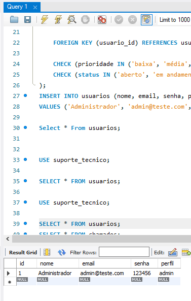
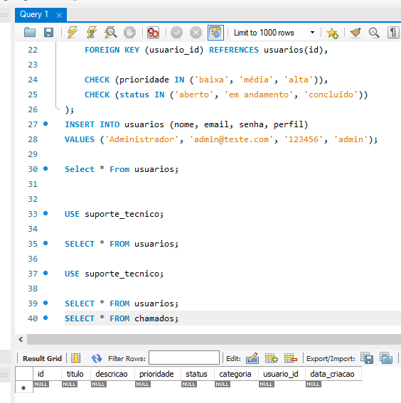
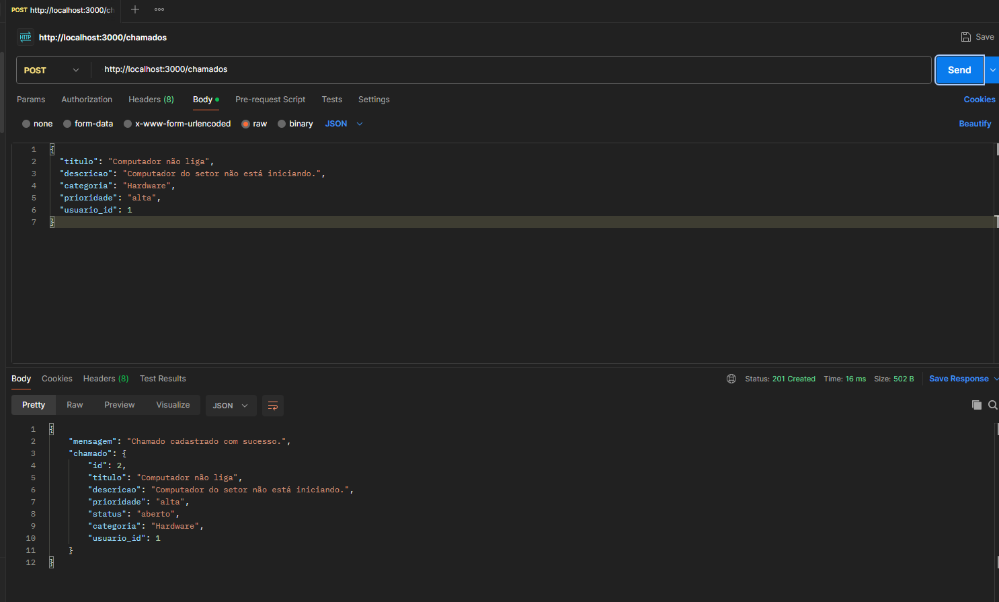
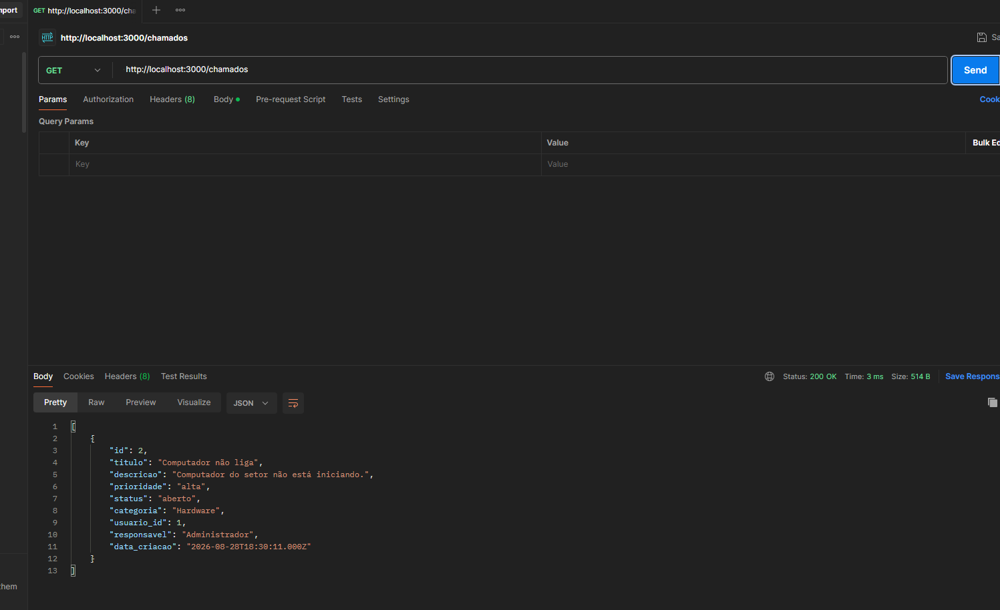

# Sistema de Chamados Técnicos

Aplicação web (Frontend → API REST → Backend → Banco de Dados) para cadastro, consulta,
atualização e acompanhamento de chamados técnicos.

## Integrantes

- (preencha aqui o(s) nome(s) do(s) integrante(s))

## Tecnologias utilizadas

- **Backend:** Node.js + Express + MySQL (mysql2)
- **Frontend:** HTML, CSS e JavaScript puro (fetch API)
- **Banco de dados:** MySQL
- **Teste de API:** Postman (ou similar)

## Estrutura do projeto

```
/projeto
├── backend
│   ├── config/db.js
│   ├── controllers/usuarioController.js
│   ├── controllers/authController.js
│   ├── controllers/chamadoController.js
│   ├── routes/usuarioRoutes.js
│   ├── routes/authRoutes.js
│   ├── routes/chamadoRoutes.js
│   ├── server.js
│   ├── package.json
│   └── .env.example
├── frontend
│   ├── index.html
│   ├── pages/login.html
│   ├── pages/dashboard.html
│   ├── pages/chamados.html
│   ├── css/style.css
│   └── js/api.js, login.js, dashboard.js, chamados.js
├── database/schema.sql
└── README.md
```

## 1. Configuração do banco de dados

O arquivo `database/schema.sql` contém o script (o mesmo que você já executou no MySQL).
Se ainda não executou, rode:

```
mysql -u root -p < database/schema.sql
```

Isso cria o banco `suporte_tecnico`, as tabelas `usuarios` e `chamados`, e um usuário
administrador de teste:

- **email:** admin@teste.com
- **senha:** 123456

## 2. Executar o backend

1. Entre na pasta do backend:
   ```
   cd backend
   ```
2. Instale as dependências:
   ```
   npm install
   ```
3. Copie o arquivo de variáveis de ambiente e ajuste com os dados do seu MySQL:
   ```
   cp .env.example .env
   ```
   Edite o `.env`:
   ```
   DB_HOST=localhost
   DB_USER=root
   DB_PASSWORD=sua_senha_mysql
   DB_NAME=suporte_tecnico
   PORT=3000
   ```
4. Inicie o servidor:
   ```
   npm start
   ```
   Se tudo estiver certo, aparecerá no terminal:
   ```
   Servidor rodando em http://localhost:3000
   ```

## 3. Executar o frontend

O frontend é HTML/CSS/JS puro, não precisa de instalação. Duas formas de abrir:

- **Opção mais simples:** abra o arquivo `frontend/pages/login.html` diretamente no navegador
  (clique duas vezes ou "Abrir com" o navegador).
- **Opção recomendada (evita eventuais bloqueios do navegador):** use a extensão "Live Server"
  do VS Code, clicando com o botão direito em `frontend/index.html` → "Open with Live Server".

Login de teste: `admin@teste.com` / `123456`.

> Importante: o backend precisa estar rodando (passo 2) para o frontend funcionar, pois todas
> as telas buscam os dados via API (`http://localhost:3000`).

## 4. Endpoints desenvolvidos

### Autenticação
- `POST /login` — autentica um usuário (email + senha)

### Usuários
- `POST /usuarios` — cadastra um novo usuário
- `GET /usuarios` — lista usuários cadastrados

### Chamados
- `GET /chamados` — lista todos os chamados
- `GET /chamados?status=aberto` — filtra por status
- `GET /chamados?prioridade=alta` — filtra por prioridade
- `GET /chamados/resumo/dashboard` — retorna as quantidades (abertos, em andamento,
  concluídos, total) usadas no dashboard
- `GET /chamados/:id` — consulta um chamado específico
- `POST /chamados` — cadastra um novo chamado
- `PUT /chamados/:id` — atualiza um chamado (título, descrição, categoria, prioridade, status)
- `DELETE /chamados/:id` — exclui um chamado

## 5. Testando com o Postman

Sugestão de sequência para demonstrar a integração:

1. `GET http://localhost:3000/usuarios` — deve listar o usuário admin.
2. `POST http://localhost:3000/chamados` com corpo JSON, por exemplo:
   ```json
   {
     "titulo": "Impressora não funciona",
     "descricao": "A impressora do setor financeiro não liga.",
     "categoria": "Hardware",
     "prioridade": "alta",
     "usuario_id": 1
   }
   ```
3. `PUT http://localhost:3000/chamados/1` com corpo JSON:
   ```json
   { "status": "em andamento" }
   ```
4. `DELETE http://localhost:3000/chamados/1` (opcional, para testar exclusão).

## 6. Observações importantes

- A senha é comparada em texto puro no backend, no mesmo formato usado no INSERT de teste
  do banco. Para um ambiente de produção real, o recomendado seria armazenar a senha com
  hash (ex: bcrypt) — fica como sugestão de melhoria futura.
- Nenhum dado é fixo no frontend: os cards do dashboard e as listagens são sempre
  carregados via `fetch` para a API.


Prints de comprovação:





